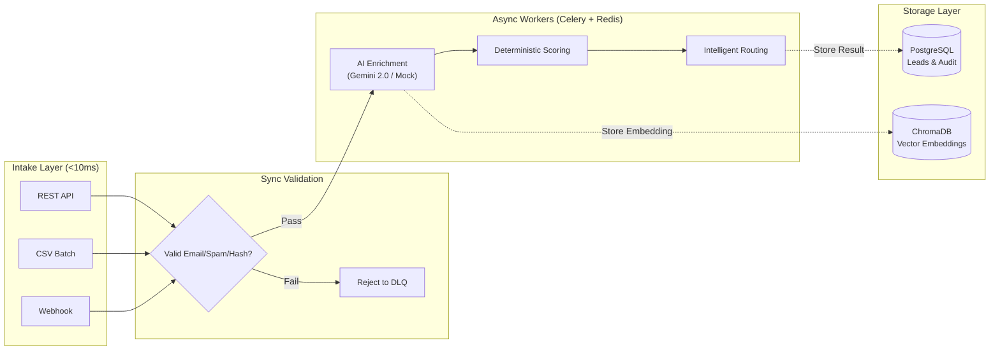
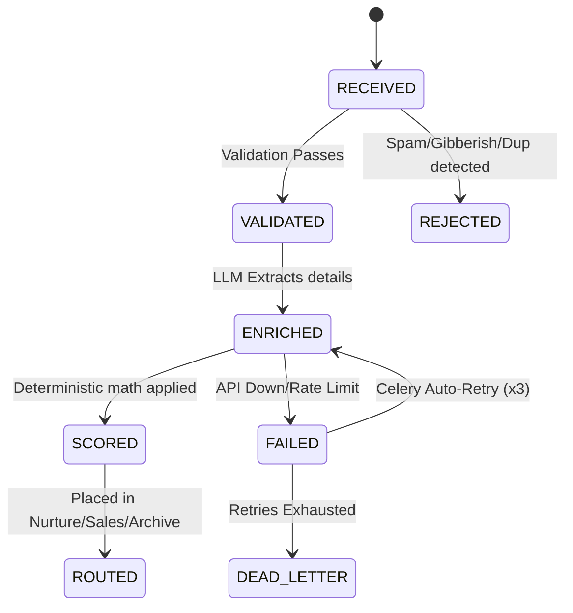

# Geta.ai — AI Powered Lead Processing Pipeline

An AI powered lead pipeline with semantic spam detection (ChromaDB), LangGraph state orchestration, and exponential backoff retry resilience. Built as a Geta.ai engineering intern assignment.

---

## System Architecture

The pipeline separates **synchronous validation** (rejections under 10ms) from **asynchronous processing** (LLM enrichment via Celery workers).



### Pipeline State Machine

Every lead transitions through a tracked state machine:



---

## Core Features

### Semantic Deduplication (ChromaDB)

Hash based dedup catches exact duplicates, but spam bots rephrase the same message with different emails and names. This pipeline goes further: each incoming message is embedded using Gemini's `text-embedding-004` model and stored in ChromaDB. On every new lead, cosine similarity is computed against existing embeddings. If similarity exceeds the threshold (default `0.85`), the lead is rejected as `SEMANTIC_DUPLICATE`, catching paraphrased spam that SHA-256 hashing alone would miss.

The system is designed to fail open. If ChromaDB or the embedding API is down, the lead passes through. Semantic dedup is a bonus safety net, not a gate.

### Validation Layer
- **Disposable Email Detection:** Rejects temporary email providers (`mailinator.com`, `guerrillamail.com`, etc.)
- **Gibberish Detection:** Mathematical character-to-letter ratio checks catch keyboard mashing
- **Spam Keywords:** Pattern matching for known spam phrases
- **SHA-256 Payload Hashing:** Deterministic content hash prevents exact duplicates

### Scoring Model

The LLM extracts structured data (Intent, Urgency, Company Type, Pain Points). This structured output is then scored using a **pure Python math function** with no LLM involvement, ensuring the same input always produces the same score.

| Signal | Max Points | Source |
|--------|-----------|--------|
| Intent Clarity | 25 | LLM enrichment |
| Urgency Signal | 20 | LLM enrichment |
| Company Completeness | 20 | Lead metadata |
| Pain Point Specificity | 20 | LLM enrichment |
| Message Quality | 15 | Rule based heuristic |

Routing thresholds are configurable via environment variables:
- `SALES_QUEUE`: Score >= 70
- `NURTURE_QUEUE`: Score 40-69
- `ARCHIVE`: Score < 40

---

## Failure Recovery

This is the core resilience layer. The pipeline uses a two-level retry system:

**Level 1 — LLM Call Retries (within a single Celery task):**
```python
LLM_RETRY_POLICY = {
    "max_attempts": 3,
    "initial_delay_seconds": 1.0,
    "backoff_multiplier": 2.0,       # 1s → 2s → 4s
    "max_delay_seconds": 10.0,
}
```

**Level 2 — Celery Task Retries (if the entire task fails):**
```python
LEAD_PIPELINE_RETRY_POLICY = {
    "max_retries": 3,
    "default_retry_delay": 1,        # Initial delay: 1 second
    "retry_backoff": True,           # Exponential backoff
    "retry_backoff_max": 30,         # Cap at 30 seconds
    "retry_jitter": True,            # Random jitter to prevent thundering herd
}
```

**Dead Letter Queue:** If all retries are exhausted, the lead is moved to `DEAD_LETTER` status with `flag_for_review = True`. This ensures no lead is silently lost. Flagged leads are queryable via the admin API.

**Worker Crash Recovery:** Tasks use `acks_late=True`, meaning Celery only acknowledges task completion after the worker finishes. If a worker crashes mid-task, Redis automatically re-queues it to another worker.

| Failure | Recovery | Retries |
|---------|----------|---------|
| LLM Timeout / 503 | Exponential backoff (1s → 2s → 4s) | 3 |
| Malformed JSON from LLM | Corrective reprompt / fallback | 3 |
| Rate Limit (429) | Backoff + jitter | 3 |
| DB Connection Loss | Pool retry → Celery task requeue | 3 |
| Worker Crash | `acks_late` re-queues to another worker | Automatic |
| All retries exhausted | Dead letter + `flag_for_review` | — |
| No API key | Mock enrichment (automatic fallback) | — |

---

## Quick Start

```bash
# Clone
git clone https://github.com/Punya23/AI_Lead.git
cd geta-lead-pipeline

# Copy env (optional: add GOOGLE_API_KEY for real LLM enrichment)
cp .env.example .env

# Start everything
docker compose up --build

# Open dashboard
open http://localhost:8000/dashboard
```

No API key is required. The system detects missing keys and falls back to a deterministic, keyword based mock enrichment engine. The full pipeline, dashboard, and routing logic work identically.

---

## Environment Variables

| Variable | Default | Description |
|----------|---------|-------------|
| `GOOGLE_API_KEY` | `your-gemini-api-key-here` | Gemini API key. Leave as-is for mock enrichment |
| `DATABASE_URL_ASYNC` | `postgresql+asyncpg://...` | PostgreSQL connection (FastAPI) |
| `DATABASE_URL_SYNC` | `postgresql+psycopg2://...` | PostgreSQL connection (Celery workers) |
| `REDIS_URL` | `redis://redis:6379/0` | Redis connection string |
| `ROUTING_HIGH_THRESHOLD` | `70` | Minimum score for Sales Queue |
| `ROUTING_MEDIUM_THRESHOLD` | `40` | Minimum score for Nurture Queue |
| `SIMULATE_FAILURES` | `false` | Enable random failure injection for testing |
| `SEMANTIC_SIMILARITY_THRESHOLD` | `0.85` | ChromaDB cosine similarity cutoff |
| `SLACK_WEBHOOK_URL` | *(empty)* | Slack notification webhook |
| `DISCORD_WEBHOOK_URL` | *(empty)* | Discord notification webhook |

---

## API Reference

### Lead Intake
| Method | Endpoint | Description |
|--------|----------|-------------|
| `POST` | `/api/v1/leads` | Submit single lead |
| `POST` | `/api/v1/leads/batch` | Upload CSV file |
| `POST` | `/api/v1/webhooks/lead` | Webhook receiver (202 Accepted) |

### Query & Admin
| Method | Endpoint | Description |
|--------|----------|-------------|
| `GET` | `/api/v1/leads` | List leads (filter: `?status=COMPLETE`) |
| `GET` | `/api/v1/leads/{id}` | Full lead detail + enrichment + score + routing |
| `GET` | `/api/v1/admin/analytics` | Dashboard metrics |
| `GET` | `/api/v1/admin/queue-status` | Pipeline processing stats |
| `GET` | `/api/v1/admin/failures` | Failed and flagged leads |
| `GET` | `/api/v1/admin/stats/routing` | Routing distribution |
| `GET` | `/api/v1/stream/pipeline` | SSE real time event stream |

### System
| Method | Endpoint | Description |
|--------|----------|-------------|
| `GET` | `/health` | DB + Redis + Worker + Queue + Enrichment mode |
| `GET` | `/health/live` | Liveness probe |
| `GET` | `/health/ready` | Readiness probe |
| `GET` | `/dashboard` | Visual dashboard UI |
| `GET` | `/docs` | Swagger UI |

---

## Tech Stack

| Layer | Technology |
|-------|-----------|
| API Framework | FastAPI (Async HTTP, Pydantic validation, Rate Limiting) |
| Message Queue | Redis + Celery |
| Database | PostgreSQL + SQLAlchemy (dual async/sync engines) |
| AI/LLM | Gemini 2.0 Flash |
| Workflow | LangGraph |
| Vector DB | ChromaDB |
| UI | Vanilla JS / CSS (Server Sent Events) |
| Infrastructure | Docker Compose |

---

## Testing

102 tests (72 unit + 30 integration).

| File | Tests | Coverage |
|------|-------|----------|
| `test_validation.py` | 17 | Email, spam keywords, gibberish, disposable domains, hashing |
| `test_scoring.py` | 16 | Deterministic math, intent/urgency edge cases |
| `test_pipeline.py` | 12 | State transitions, routing thresholds |
| `test_retry.py` | 15 | Exponential backoff, failure simulation, dead letter routing |
| `test_integration.py` | 30 | Full Docker stack + real Gemini API |

```bash
# Unit tests (no Docker needed)
pytest tests/ -v --ignore=tests/test_integration.py

# Integration tests (Docker must be running)
pytest tests/test_integration.py -v
```

---

## Architecture Decisions and Tradeoffs

| Decision | Reasoning |
|----------|-----------|
| ChromaDB for semantic dedup | Hash based dedup misses paraphrased spam. Vector similarity catches it |
| LangGraph over pure Celery chains | Explicit state machine with named nodes. Each node is idempotent and individually resumable on failure, unlike chained tasks where a mid-chain failure requires replaying the entire chain |
| Gemini over OpenAI | Free tier sufficient for demo. Removes cost barrier when running locally |
| Deterministic scoring (post-LLM) | LLMs are non-deterministic. Same lead must always produce the same score and route to the same queue. Pure Python math ensures this |
| Dual SQLAlchemy engines | FastAPI uses asyncpg (async). Celery uses psycopg2 (sync). Prevents event loop conflicts |
| Mock enrichment fallback | Pipeline runs without API keys. No setup friction |

### Known Limitations
- ChromaDB runs in-process in Docker with file persistence. A production deployment would use a dedicated ChromaDB server or a managed vector database
- Celery retry counters are stored in Redis. If Redis restarts, in-flight retry counters reset
- Scoring weights are hardcoded. A production system would load them from a config store for A/B testing

---

## What I Would Improve With More Time

- Replace in-process ChromaDB with a dedicated persistent vector store (Pinecone, Weaviate)
- Add Flower for real time Celery task monitoring and visibility
- Build a webhook retry confirmation system with delivery receipts
- Add per-tenant routing configuration for multi-customer deployments
- Add Prometheus metrics endpoint for observability
- Make scoring weights configurable via admin API for experimentation
- Add rate limiting per API key rather than global limits

---
*Developed for the Geta.ai Backend Engineering assignment.*
