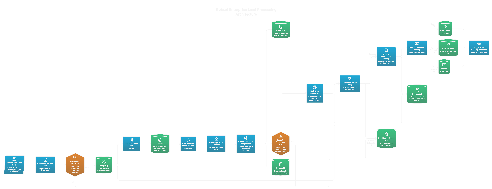
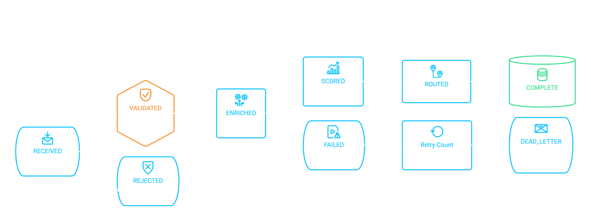
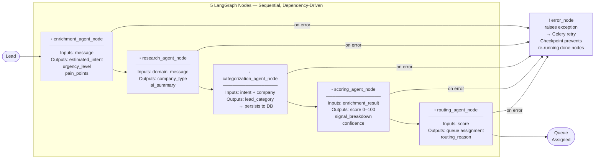
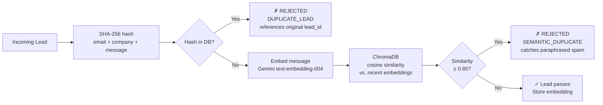
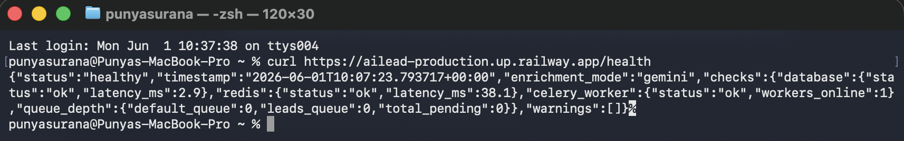
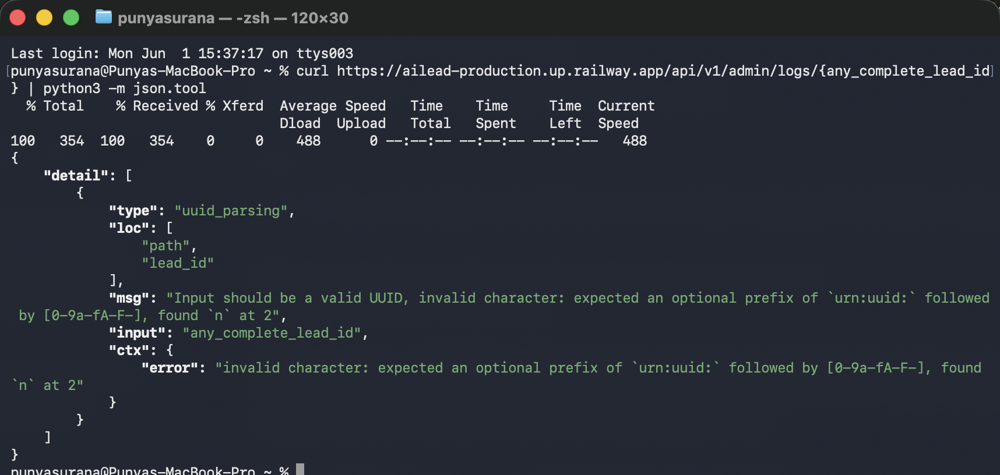

# ▸ Geta AI — Lead Processing Pipeline

> **Reliability first. AI second.**  
> A production-grade, fault-tolerant lead pipeline with a **5-agent LangGraph orchestration** (Enrichment → Research → Categorization → Scoring → Routing), semantic spam detection via ChromaDB, and a two-level exponential backoff retry system — built as a Geta.ai engineering intern assignment.

**Live Demo:** [https://ailead-production.up.railway.app/dashboard](https://ailead-production.up.railway.app/dashboard)  
**API Docs:** [https://ailead-production.up.railway.app/docs](https://ailead-production.up.railway.app/docs)  
**Demo Video:** [Watch on Loom (5 Min Walkthrough)](https://www.loom.com/share/e24ed14f32cc479396730269f7b534db)

---

## Why This Exists

Most AI pipelines are fragile happy-path demos. They break the moment an LLM times out, returns malformed JSON, or the same lead is submitted twice with a rephrased message.

This system was designed to handle all of that gracefully:

- Synchronous validation rejects bad data in **under 10ms** — before any LLM call is made
- Three specialized Gemini agents handle enrichment with strict JSON schemas and corrective-prompt retries
- Scoring and routing use **pure Python math** — no LLM, no non-determinism
- Every failure has a defined recovery path — no lead is ever silently lost

---

## System Architecture



---

## Pipeline State Machine



---

## The 5-Agent LangGraph Pipeline



> **Why sequential, not parallel?**  
> `categorization_agent_node` needs **both** intent (from enrichment) **and** company context (from research). The dependency chain forces the order. `scoring_agent_node` and `routing_agent_node` use no LLM at all — eliminating non-determinism from the critical routing decision.

---

## Failure Recovery — Two-Level System


**Level 1 — LLM Call Retries** (within a single Celery task):
```python
LLM_RETRY_POLICY = {
    "max_attempts": 3,
    "initial_delay_seconds": 2.0,
    "backoff_multiplier": 2.0,    # 2s → 4s → 8s
    "max_delay_seconds": 10.0,
}
```

**Level 2 — Celery Task Retries** (if the entire task fails):
```python
LEAD_PIPELINE_RETRY_POLICY = {
    "max_retries": 3,
    "default_retry_delay": 1,
    "retry_backoff": True,        # exponential backoff
    "retry_backoff_max": 30,      # cap at 30 seconds
    "retry_jitter": True,         # prevents thundering herd
    "acks_late": True,            # re-queues on worker crash
}
```

| Failure | Level 1 (LLM) | Level 2 (Celery) | Final State |
|---|---|---|---|
| LLM Timeout | 3× backoff (2s/4s/8s) | 3× task retry | DEAD_LETTER |
| Malformed JSON | Corrective prompt + retry | 3× task retry | DEAD_LETTER |
| Rate Limit (429) | Wait + jitter, retry 3× | 3× task retry | DEAD_LETTER |
| DB Connection Loss | — | Pool retry → task requeue | DEAD_LETTER |
| Worker Crash | — | `acks_late` auto re-queues | Resumes cleanly |
| All retries exhausted | — | Dead letter + `flag_for_review` | DEAD_LETTER |
| No API key | — | Mock enrichment activated | COMPLETE |

> **Node-level checkpoint:** A `pipeline_checkpoint` JSONB column on each lead stores each node's output as it completes. On Celery retry, nodes that already succeeded read from the checkpoint and **skip their LLM calls entirely**. A crash during `research_agent_node` does not re-bill the `enrichment_agent_node` call.

---

## Duplicate & Spam Detection



> **Fail-open design:** If ChromaDB or the embedding API is unavailable, the lead passes through. Semantic dedup is a bonus safety net, not a blocking gate. Availability matters more than perfect dedup accuracy.

Additional validation checks run before the dedup step:
- **Disposable email detection** — rejects `mailinator.com`, `guerrillamail.com`, and other known temporary providers
- **Gibberish detection** — character-to-letter ratio catches keyboard mashing
- **Spam keyword matching** — pattern-based filter for known spam phrases
- **Required field validation** — name, email, company, message all enforced by Pydantic v2

---

## Scoring Model

The three AI agents extract structured data. A **pure Python function** then scores it — no LLM, no randomness.

| Signal | Max Points | Source |
|---|---|---|
| Estimated intent clarity | 25 | `enrichment_agent_node` |
| Urgency level | 20 | `enrichment_agent_node` |
| Company completeness | 20 | `research_agent_node` |
| Pain point specificity | 20 | `enrichment_agent_node` |
| Message quality | 15 | Rule-based heuristic |
| **Total** | **100** | |

Every score response includes a `signal_breakdown` dict with per-signal point contributions — never just a number. Routing thresholds are configurable via environment variables:

| Score | Queue |
|---|---|
| ≥ 70 | `SALES_QUEUE` |
| 40 – 69 | `NURTURE_QUEUE` |
| < 40 | `ARCHIVE` |

---

## Real-Time SSE Dashboard

A live processing dashboard streams pipeline events over Server-Sent Events as each lead moves through nodes. Open `/dashboard` to watch:

```
RECEIVED → VALIDATED → ENRICHED → SCORED → ROUTED → COMPLETE
```

No polling. No page refresh. Failures, retries, and dead-letter events appear instantly. Each state transition is driven by an event published at the end of its corresponding LangGraph node.

---

## Quick Start

```bash
git clone https://github.com/Punya23/AI_Lead
cd AI_Lead
cp .env.example .env
# GOOGLE_API_KEY is optional — mock fallback activates automatically without it
docker compose up --build
```

The entire stack (API, Worker, PostgreSQL, Redis) starts with one command. Alembic migrations run automatically on startup.

```bash
# Verify the stack is healthy
curl http://localhost:8000/health
```
```json
{
  "status": "healthy",
  "db": "ok",
  "redis": "ok",
  "worker": "ok",
  "enrichment_mode": "gemini"
}
```

Open the live dashboard: **http://localhost:8000/dashboard**

---

## Environment Variables

| Variable | Required | Default | Description |
|---|---|---|---|
| `GOOGLE_API_KEY` | No | — | Gemini API key (`AIzaSy...`). Mock fallback activates without it |
| `DATABASE_URL_ASYNC` | Yes | — | `postgresql+asyncpg://...` — FastAPI async engine |
| `DATABASE_URL_SYNC` | Yes | — | `postgresql+psycopg2://...` — Celery sync engine |
| `REDIS_URL` | Yes | — | Redis connection string |
| `ROUTING_HIGH_THRESHOLD` | No | `70` | Minimum score for SALES_QUEUE |
| `ROUTING_MEDIUM_THRESHOLD` | No | `40` | Minimum score for NURTURE_QUEUE |
| `SIMULATE_FAILURES` | No | `false` | Set `true` to inject random LLM failures for demo |
| `SEMANTIC_SIMILARITY_THRESHOLD` | No | `0.85` | Cosine similarity cutoff for semantic dedup |
| `LLM_MODEL` | No | `gemini-2.0-flash` | Gemini model to use for all agents |
| `LLM_MAX_RETRIES` | No | `3` | Max LLM-level retry attempts per node |
| `LLM_TIMEOUT_SECONDS` | No | `30` | Per-call LLM timeout |
| `SLACK_WEBHOOK_URL` | No | — | Slack notifications for dead-letter events |
| `DISCORD_WEBHOOK_URL` | No | — | Discord notifications for dead-letter events |

---

## Demo Walkthrough

### 1. Submit a high-intent lead
```bash
curl -X POST http://localhost:8000/api/v1/leads \
  -H "Content-Type: application/json" \
  -d '{
    "name": "Sarah Chen",
    "email": "sarah@acmesaas.io",
    "company": "Acme SaaS",
    "message": "We need AI automation for our outbound sales pipeline urgently. Budget is approved for Q1."
  }'
```

### 2. Watch it in real time
Open **http://localhost:8000/dashboard** and watch the lead transition through every state live.

### 3. Inspect the full record and execution trace
```bash
curl http://localhost:8000/api/v1/leads/{lead_id}
curl http://localhost:8000/api/v1/admin/logs/{lead_id}
```
The logs endpoint shows every node that ran — with timestamp, duration, and attempt number.

### 4. Upload a CSV batch
```bash
# A sample CSV with 5 leads is included in scripts/
curl -X POST http://localhost:8000/api/v1/leads/batch \
  -F "file=@scripts/demo_leads.csv"
```

### 5. Simulate failures (dead-letter demo)
```bash
# In .env: SIMULATE_FAILURES=true — then restart
docker compose up

# After ~45 seconds, check the dead letter queue
curl http://localhost:8000/api/v1/admin/failures
```

### 6. Test semantic duplicate detection
```bash
# Submit the original
curl -X POST http://localhost:8000/api/v1/leads \
  -H "Content-Type: application/json" \
  -d '{"name":"Original","email":"original@realco.io","company":"RealCo",
       "message":"We urgently need AI automation for our sales pipeline. Budget approved."}'

# Submit a paraphrased version with a different email
curl -X POST http://localhost:8000/api/v1/leads \
  -H "Content-Type: application/json" \
  -d '{"name":"Spammer","email":"different@spambot.net","company":"SpamCo",
       "message":"We critically require AI tools for immediate sales workflow automation. Funding ready."}'
# → Returns: REJECTED / SEMANTIC_DUPLICATE
```

---

## Screenshots

### Live Dashboard


### Per-Node Execution Trace (5 agents logged)


---

## API Reference

### Lead Intake
| Method | Endpoint | Description |
|---|---|---|
| `POST` | `/api/v1/leads` | Submit single lead — validates sync, queues async |
| `POST` | `/api/v1/leads/batch` | Upload CSV — returns per-row reject reasons |
| `POST` | `/api/v1/webhooks/lead` | Webhook receiver — returns 202, processes async |

### Query
| Method | Endpoint | Description |
|---|---|---|
| `GET` | `/api/v1/leads` | Paginated list — filter by `?status=FAILED` |
| `GET` | `/api/v1/leads/{id}` | Full record + enrichment + score + routing decision |

### Admin & Observability
| Method | Endpoint | Description |
|---|---|---|
| `GET` | `/api/v1/admin/logs/{id}` | Per-node execution trace for a lead |
| `GET` | `/api/v1/admin/failures` | All leads with `flag_for_review = true` |
| `GET` | `/api/v1/admin/queue-status` | Active / queued / failed counts |
| `GET` | `/api/v1/admin/analytics` | Dashboard metrics and throughput stats |
| `GET` | `/api/v1/admin/stats/routing` | Routing distribution breakdown |
| `GET` | `/api/v1/stream/pipeline` | SSE event stream (raw) |

### System
| Method | Endpoint | Description |
|---|---|---|
| `GET` | `/health` | Full system status — DB, Redis, worker, enrichment mode |
| `GET` | `/health/live` | Liveness probe |
| `GET` | `/health/ready` | Readiness probe |
| `GET` | `/dashboard` | Live SSE dashboard UI |
| `GET` | `/docs` | Swagger interactive docs |

---

## Tech Stack

| Layer | Technology |
|---|---|
| Runtime | Python 3.11+ |
| API Framework | FastAPI (async) + Pydantic v2 |
| Workflow Orchestration | LangGraph |
| Task Queue | Celery + Redis |
| Database | PostgreSQL · SQLAlchemy 2.0 (asyncpg + psycopg2) · Alembic |
| Vector Store | ChromaDB |
| LLM | Google Gemini 2.0 Flash + deterministic mock fallback |
| Logging | loguru (structured JSON) |
| HTTP Client | httpx (async) |
| Containers | Docker + Docker Compose |
| Deployment | Railway |

> **Why two SQLAlchemy engines?** FastAPI is fully async and requires `asyncpg`. Celery workers are synchronous and use `psycopg2`. Mixing them causes event loop conflicts — discovered during development. They share the same PostgreSQL instance through separate engine instances.

---

## Testing

```bash
pytest tests/ -v                       # all 108 tests
pytest tests/ -v --ignore=tests/test_integration.py  # unit only (no Docker)
pytest tests/test_pipeline.py -v       # graph traversal, state accumulation, error routing
pytest tests/test_retry.py -v          # checkpoint resume, backoff, dead-letter
pytest tests/test_integration.py -v    # full Docker stack
```

| File | Tests | What it covers |
|---|---|---|
| `test_validation.py` | 17 | Email format, disposable domains, gibberish detection, SHA-256 dedup, semantic dedup |
| `test_scoring.py` | 16 | Weighted signal math, determinism with identical inputs, score boundaries |
| `test_pipeline.py` | 20 | 5-node graph traversal, state accumulation between nodes, error propagation, checkpoint resume |
| `test_retry.py` | 19 | LLM-level exponential backoff, corrective prompt on malformed JSON, Celery dead-letter, checkpoint prevents redundant LLM calls |
| `test_integration.py` | 36 | Full Docker stack — happy path, failure simulation, semantic dedup, multi-agent output, queue assignment |
| **Total** | **108** | **72 unit · 36 integration** |

Notable: class-level mock patching ensures no test method can accidentally hit the real Gemini API. A `test_checkpoint_resume` case manually corrupts the research node checkpoint to simulate a mid-pipeline crash and verifies the enrichment node is skipped on retry (LLM call count = 0).

---

## Architecture Decisions & Tradeoffs

| Decision | Why |
|---|---|
| **5 LangGraph agents over a single prompt** | Each node has one responsibility, one schema, and independent error handling. A failure in research doesn't touch enrichment output. |
| **Sequential agents (not parallel)** | `categorization_agent_node` requires both intent (from enrichment) and company context (from research). The dependency chain forces the order. |
| **Deterministic Python scoring** | LLMs are non-deterministic. The same lead must always route to the same queue. Scoring and routing use zero LLM calls. |
| **Lightweight JSONB checkpoint over full LangGraph persistence** | Prevents redundant LLM calls on Celery retry without the operational overhead of a PostgreSQL-backed LangGraph checkpointer. Solves the practical problem for this scope. |
| **Dual SQLAlchemy engines** | FastAPI requires asyncpg; Celery is synchronous. Mixing them causes event loop conflicts found in development. |
| **ChromaDB fail-open** | Semantic dedup is a bonus safety net. If it's down, leads pass through. Availability matters more than perfect dedup. |
| **Dead-letter over silent fallback** | A lead routed on fake AI output is worse than an unrouted lead. Dead-lettering with `flag_for_review` ensures a human makes the call when AI fails. |
| **422 for duplicates (not 409)** | Duplicate check intercepts early in the FastAPI validation layer. `409 Conflict` would be semantically correct in a V2 API — documented as a known tradeoff. |
| **Gemini Flash over GPT-4** | Free tier sufficient. Removes the cost barrier for local evaluation. |
| **Mock fallback** | Full pipeline runs without an API key — zero setup friction for evaluators. |

---

## Known Limitations

- **ChromaDB is ephemeral in Docker** — the vector store resets on container restart. Production would use a dedicated server or pgvector co-located with PostgreSQL
- **Celery retry counters reset on Redis restart** — in-flight counters are lost if Redis crashes. Full LangGraph PostgreSQL checkpointing would address this at the cost of additional infrastructure
- **Scoring weights are hardcoded** — production would load weights from a config store to enable A/B testing without deploys
- **No Flower UI** — Celery monitoring is via `/admin/queue-status`; a Flower container would give richer real-time task visibility
- **Legacy edge functions** — `should_score_or_skip` and `should_route_or_end` remain in the codebase from the pre-LangGraph monolithic design; both have stale node references and are unused

---

## What I Would Improve With More Time

- Replace in-memory ChromaDB with a persistent Pinecone or pgvector deployment
- Add Flower for real-time Celery task monitoring and dashboards
- Make scoring weights configurable via admin API for A/B experimentation without deploys
- Add per-tenant routing configuration for multi-customer deployments
- Add a Prometheus metrics endpoint for observability dashboards
- Implement webhook retry confirmation with delivery receipts
- Refactor duplicate rejection to return `409 Conflict` with a `duplicate_of` field pointing to the original lead ID
- Remove the legacy unused conditional edge functions

---

*Built for the Geta.ai Backend Engineering Intern assignment.*
