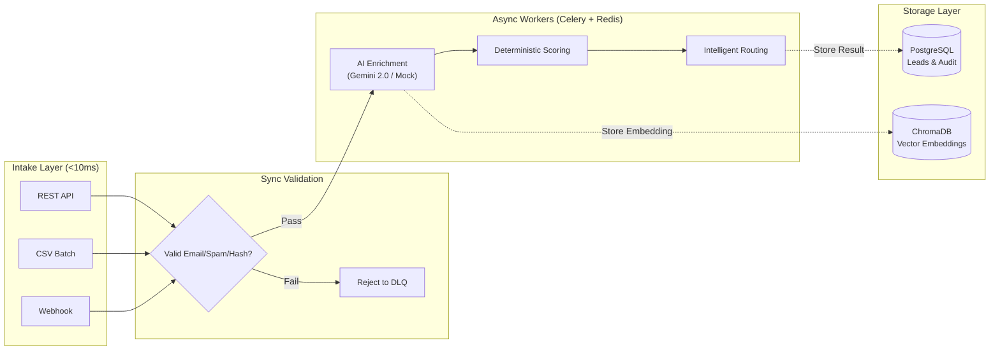
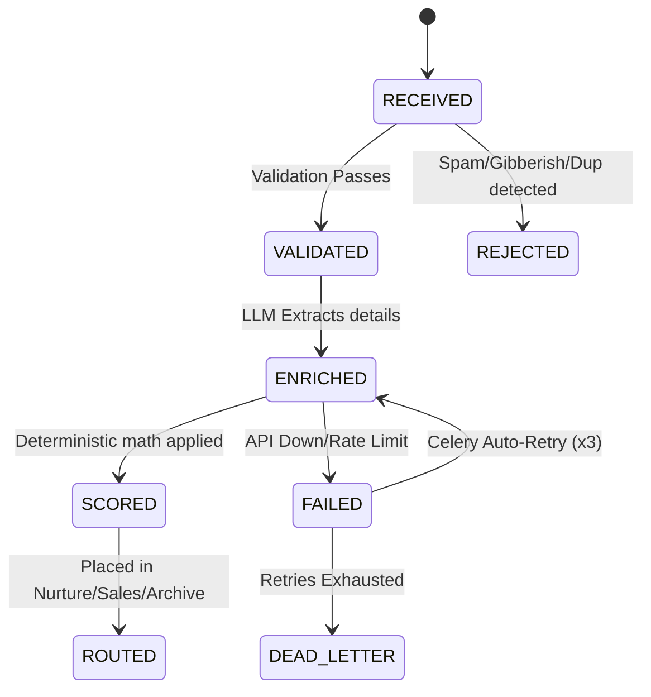

# Geta.ai — AI-Powered Lead Processing Pipeline

An asynchronous, fault-tolerant lead processing engine featuring LangGraph orchestration, semantic anti-spam via ChromaDB vector embeddings, and a real-time Server-Sent Events (SSE) dashboard. 

This pipeline is designed to ingest leads at high volume, instantly reject spam using advanced vector embeddings, and reliably enrich them using LLMs asynchronously (Celery + Redis) while surviving LLM rate-limits and database outages.

---

## 🧠 System Architecture

The pipeline strictly separates **synchronous validation** (fast rejections) from **asynchronous processing** (LLM tasks).



### Pipeline State Machine
The entire lifecycle of a lead is tracked transactionally:



---

## 🛠️ Core Features

### Advanced Validation & Anti-Spam
- **Semantic Vector Deduplication (ChromaDB):** Spam bots constantly change their email addresses. This pipeline embeds the actual message text into a vector database. If a new lead has a high semantic similarity to a previously ingested lead, it is instantly routed to the Dead-Letter Queue—even if the name and email are different.
- **Gibberish & Disposable Domain Detection:** Mathematical checks for low character-to-letter ratios and instantaneous rejection of temporary emails (e.g., `mailinator.com`).
- **Cryptographic Hashing:** Every payload is SHA-256 hashed to prevent identical duplicate submissions.

### Intelligent Routing & Scoring
- **LLM Data Extraction:** Gemini 2.0 Flash is prompted to output strict JSON schemas (Intent, Urgency, Budget, Pain Points) using Pydantic validation.
- **Deterministic Scoring:** The LLM's structured output is passed to a pure Python math function. This ensures that scoring is 100% testable and reproducible, eliminating LLM hallucination in the actual routing logic.
- **Queue Assignment:** Leads are dynamically assigned to `SALES_QUEUE` (≥ 70), `NURTURE_QUEUE` (40-69), or `ARCHIVE` (< 40).

### Fault Tolerance & Resilience
- **LangGraph Orchestration:** Manages the state machine. If the Gemini API times out, rate-limits (429), or returns malformed JSON, the Celery worker triggers exponential backoff (up to 3 retries) before safely archiving the lead.
- **Mock Enrichment Fallback:** Pre-configured deterministic fallbacks allow the pipeline to run completely offline or without API keys.

---

## 🚀 Quick Start

```bash
# 1. Clone the repository
git clone https://github.com/Punya23/AI_Lead.git
cd geta-lead-pipeline

# 2. Copy env (Optional: Add GOOGLE_API_KEY for real LLM enrichment)
cp .env.example .env

# 3. Start the entire stack (FastAPI, Postgres, Redis, Celery Workers)
docker compose up --build

# 4. Open the interactive dashboard
open http://localhost:8000/dashboard
```

---

## 💻 Tech Stack

| Layer | Technology |
|-------|-----------|
| **API Framework** | FastAPI (Async HTTP, Pydantic validation, Rate Limiting) |
| **Message Queue** | Redis + Celery |
| **Database** | PostgreSQL + SQLAlchemy |
| **AI/LLM** | Gemini 2.0 Flash |
| **Workflow** | LangGraph |
| **Vector DB** | ChromaDB |
| **UI** | Vanilla JS / CSS (Server-Sent Events) |
| **Infrastructure** | Docker Compose |

---

## 🧪 Testing

The pipeline is tested with **102 tests** (72 unit + 30 live integration tests). 

Test coverage includes:
- **Unit Tests:** Email validation, spam keywords, gibberish detection, hashing, deterministic math scoring, state transitions, exponential backoff, and mock failure recovery.
- **Integration Tests:** Full Docker Stack Integration tests hitting real Gemini APIs.

To run the tests:
```bash
# Run unit tests (No Docker required)
pytest tests/ -v --ignore=tests/test_integration.py

# Run full integration tests (Requires Docker to be running)
pytest tests/test_integration.py -v
```

---
*Developed for the Geta.ai Backend Engineering assignment.*
