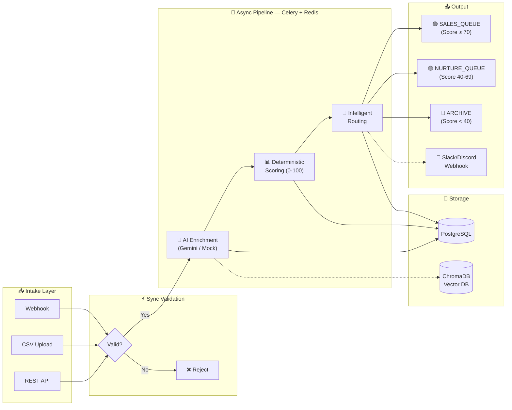
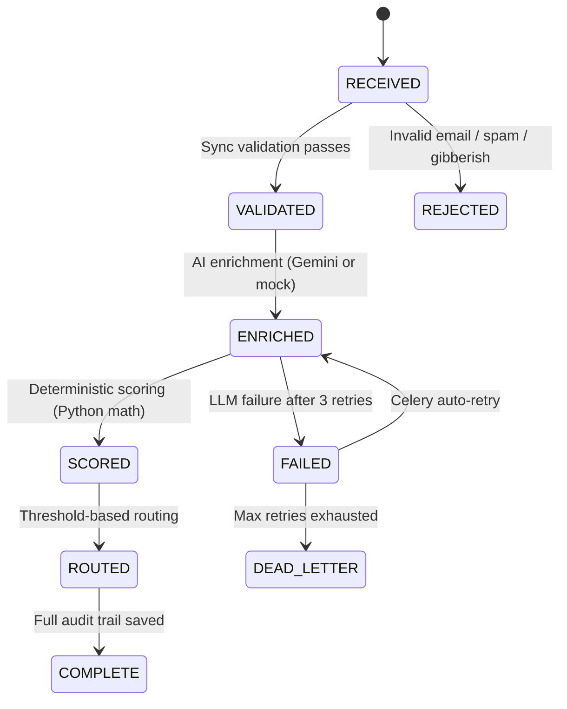

# Geta.ai — AI-Powered Lead Processing Pipeline

> **Zero-config startup**: `docker compose up --build` → open `http://localhost:8000/dashboard`
>
> Works with or without a Gemini API key. No `.env` changes required.

---

## System Architecture



## Pipeline Flow



## Live Dashboard

The system includes a **visual dashboard** at `/dashboard` — no separate frontend build needed.

| Feature | Description |
|---------|-------------|
| **Lead Form** | Submit leads with pre-fill examples (Good Lead / Spam / Low Intent) |
| **Pipeline Visualizer** | 5-stage animated progress bar lights up in real-time via SSE |
| **AI Results** | Shows enrichment category, intent, urgency, pain points, AI summary |
| **Score Display** | Color-coded score circle (green ≥70, amber ≥40, red <40) + routing badge |
| **Analytics Cards** | Total / Qualified / Nurture / Rejected — auto-refreshing |
| **Live Event Feed** | Real-time SSE pipeline events (terminal-style) |

---

## Quick Start

```bash
# Clone
git clone https://github.com/Punya23/AI_Lead.git && cd geta-lead-pipeline

# Copy env (optional: add GOOGLE_API_KEY for real AI enrichment)
cp .env.example .env

# Start everything
docker compose up --build

# Open dashboard
open http://localhost:8000/dashboard
```

> **No API key?** The system automatically uses mock enrichment (keyword-based analysis). The full pipeline works identically.

## Key Design Decisions

| Decision | Why |
|----------|-----|
| **Sync validation, async pipeline** | Reject bad leads in <1ms. AI enrichment takes 3-6s — never block HTTP. |
| **Deterministic scoring** | LLMs are non-deterministic. Same lead → same score → same queue. Always. Testable. |
| **Dual SQLAlchemy engines** | FastAPI = async (asyncpg). Celery = sync (psycopg2). No event loop conflicts. |
| **LangGraph orchestration** | Declarative state graph. Each node is idempotent — safe to retry. |
| **Mock enrichment fallback** | No API key? Rule-based keyword analysis. Pipeline never breaks. |
| **Content-based dedup** | SHA-256(email + company + message). No timestamp edge cases. |

## Failure Recovery

| Failure | Recovery | Retries |
|---------|----------|---------|
| LLM Timeout | Exponential backoff (1s → 2s → 4s) | 3 |
| Malformed JSON | Corrective prompt retry | 3 |
| Rate Limit (429) | Backoff + jitter | 3 |
| DB Connection | Pool retry → Celery retry | 3 |
| Duplicate Lead | Reject immediately (hash check) | 0 |
| Worker crash | `acks_late` + auto re-queue | 3 |
| No API key | Mock enrichment (automatic) | — |
| All retries fail | Dead-letter + flag for review | — |

## API Endpoints

### Lead Intake
| Method | Endpoint | Description |
|--------|----------|-------------|
| `POST` | `/api/v1/leads` | Submit single lead |
| `POST` | `/api/v1/leads/batch` | Upload CSV file |
| `POST` | `/api/v1/webhooks/lead` | Webhook (202 Accepted) |

### Query & Admin
| Method | Endpoint | Description |
|--------|----------|-------------|
| `GET` | `/api/v1/leads` | List leads (`?status=qualified`) |
| `GET` | `/api/v1/leads/{id}` | Full detail + enrichment + score + routing |
| `GET` | `/api/v1/admin/analytics` | Dashboard metrics |
| `GET` | `/api/v1/admin/queue-status` | Pipeline processing stats |
| `GET` | `/api/v1/admin/failures` | Failed & flagged leads |
| `GET` | `/api/v1/admin/stats/routing` | Routing distribution |
| `GET` | `/api/v1/stream/pipeline` | SSE real-time events |

### System
| Method | Endpoint | Description |
|--------|----------|-------------|
| `GET` | `/health` | DB + Redis + Worker + Queue + Enrichment mode |
| `GET` | `/health/live` | Liveness probe |
| `GET` | `/health/ready` | Readiness probe |
| `GET` | `/dashboard` | Visual dashboard UI |
| `GET` | `/docs` | Swagger UI with examples |

## Testing

**102 tests** — 72 unit + 30 live integration tests.

| File | Tests | Type | Coverage |
|------|-------|------|----------|
| `test_validation.py` | 17 | Unit | Email, spam, gibberish, disposable domains, hashing |
| `test_scoring.py` | 16 | Unit | Intent, urgency, pain points, determinism |
| `test_pipeline.py` | 12 | Unit | Score→routing integration, thresholds |
| `test_retry.py` | 15 | Unit | Fallback, failure simulation, exceptions |
| `test_integration.py` | 30 | **Integration** | **Full Docker stack + real Gemini API** |

```bash
# Unit tests (no Docker needed)
pytest tests/ -v --ignore=tests/test_integration.py

# Integration tests (Docker must be running)
pytest tests/test_integration.py -v

# Everything
pytest tests/ -v
```

## Tech Stack

| Layer | Technology | Purpose |
|-------|-----------|---------|
| API | FastAPI | Async HTTP, Pydantic validation, auto-docs |
| Queue | Redis + Celery | Reliable task delivery, crash recovery |
| Database | PostgreSQL | ACID transactions, JSONB flexibility |
| AI/LLM | Gemini 2.0 Flash | Structured JSON enrichment |
| Workflow | LangGraph | Declarative pipeline state machine |
| Vector DB | ChromaDB | Semantic near-duplicate detection |
| Rate Limit | slowapi + Redis | Per-endpoint throttling |
| Notifications | Slack/Discord | Non-blocking webhook delivery |
| Streaming | SSE + Redis Pub/Sub | Real-time pipeline events |
| Containers | Docker Compose | One-command startup |

## Bonus Features

| Feature | Status |
|---------|--------|
| LangGraph workflow | ✅ |
| ChromaDB vector dedup | ✅ |
| Slack/Discord notifications | ✅ |
| Rate limiting | ✅ |
| SSE streaming | ✅ |
| Docker Compose | ✅ |
| Admin analytics API | ✅ |
| Visual dashboard | ✅ |
| Mock enrichment (no API key) | ✅ |
| 102 automated tests | ✅ |

## Project Structure

```
geta-lead-pipeline/
├── app/
│   ├── api/routes/         # leads, webhooks, admin, health, stream
│   ├── core/               # config, database, logging, middleware
│   ├── models/             # SQLAlchemy ORM (5 tables)
│   ├── schemas/            # Pydantic request/response
│   ├── services/           # validation, enrichment, scoring, routing,
│   │                       #   llm_client, langgraph, vector_store, notifications
│   └── tasks/              # Celery tasks + retry policies
├── static/                 # Dashboard HTML
├── tests/                  # 102 tests (72 unit + 30 integration)
├── docker/                 # Dockerfiles
├── ARCHITECTURE.md         # Design decisions
├── DEBUGGING.md            # Operational runbook
└── docker-compose.yml      # One-command startup
```
