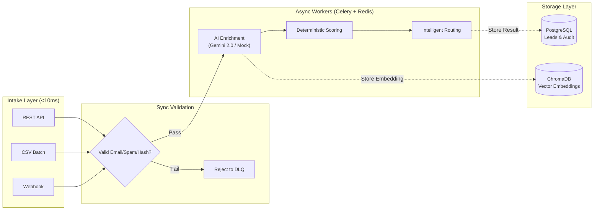
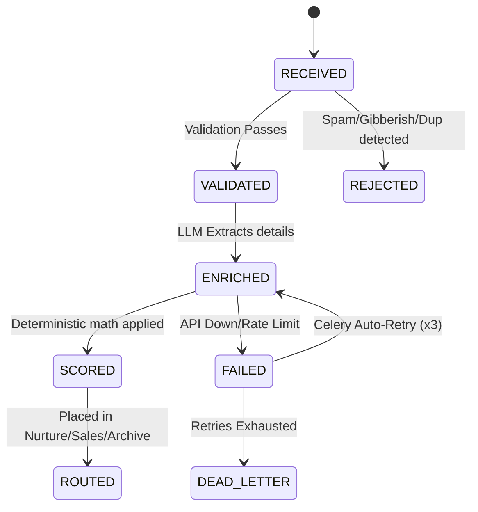

# Geta.ai — Enterprise-Grade AI Lead Processing Pipeline

**An asynchronous, fault-tolerant lead processing engine featuring LangGraph orchestration, semantic anti-spam via ChromaDB vector embeddings, and a real-time SSE dashboard.**

This is not just a standard CRUD API. This pipeline is designed to ingest thousands of leads, instantly reject spam using advanced vector embeddings, and reliably enrich them using LLMs asynchronously (Celery + Redis) while surviving LLM rate-limits and database outages.

---

## ⚡ The "Wow" Factor (Why this stands out)

*   **Real-Time Interactive Dashboard:** No frontend framework required. Just open `localhost:8000/dashboard` to see a beautiful dark-mode interface featuring real-time Server-Sent Events (SSE) that stream pipeline logs and visual progress bars as background workers process leads.
*   **Semantic Anti-Spam (ChromaDB):** Spam bots constantly change their email addresses. This pipeline embeds the actual *message text* into a vector database. If a new lead has a semantic similarity of `1.0` to a previously ingested lead, it is instantly routed to the Dead-Letter Queue as a `SEMANTIC_DUPLICATE`—even if the name and email are completely different!
*   **Bulletproof Fault Tolerance:** LangGraph orchestrates the state machine. If the Gemini API times out, rate-limits (429), or returns malformed JSON, the Celery worker triggers exponential backoff (up to 3 retries) before safely archiving the lead in the Dead-Letter Queue.
*   **Frictionless Evaluation:** Pre-configured mock-LLM fallbacks mean the entire pipeline works perfectly offline or without API keys.

---

## 🚀 Quick Start (Zero-Friction)

```bash
# 1. Clone the repository
git clone https://github.com/Punya23/AI_Lead.git
cd geta-lead-pipeline

# 2. Copy env (Optional: Add GOOGLE_API_KEY for real LLM enrichment)
cp .env.example .env

# 3. Start the entire stack (FastAPI, Postgres, Redis, Celery Workers)
docker compose up --build

# 4. Open the interactive dashboard
open http://localhost:8000/dashboard
```

> **No API key? No problem.** The system automatically detects missing keys and falls back to a deterministic, keyword-based mock enrichment engine. The entire pipeline, dashboard, and routing logic work exactly the same!

---

## 🕵️ Testing Guide (How to Test the System)

The absolute best way to experience this pipeline is through the Live Dashboard (`http://localhost:8000/dashboard`).

### 1. Test the AI Enrichment & Routing
1. Open the dashboard and click the **"Good Lead"** button. This automatically generates a randomized, unique lead.
2. Click **Submit**.
3. Watch the visualizer track the lead through `Ingestion → Validation → Celery Async → Enrichment → Routing`.
4. Observe how it is scored >70 and dynamically assigned to the `SALES_QUEUE`.

### 2. Test the Semantic Anti-Spam
1. In the REST API tab, type a custom message like: *"We need cheap blockchain tokens immediately."*
2. Submit it. It should process successfully.
3. Now, change the Name and Email completely, but keep the message exactly the same: *"We need cheap blockchain tokens immediately."*
4. Submit it again. Watch the dashboard instantly reject it as a `SEMANTIC_DUPLICATE` because ChromaDB recognized the identical vector embedding!

### 3. Test Real CSV Batch Ingestion
1. Go to the **CSV Upload** tab.
2. Click **Download Template CSV** to grab the required schema (`name,email,company,message,source`).
3. Fill it with a mix of valid leads and a lead with a disposable email (e.g., `@mailinator.com`).
4. Upload it. The system will asynchronously queue the valid leads to the Celery workers while instantly rejecting the disposable email to the DLQ! (You can also just click *Auto-Generate & Submit Batch* to see this in action immediately).

### 4. Test Fault Tolerance & Recovery
1. Check the **"Simulate LLM Failure"** checkbox at the top of the dashboard.
2. Submit a valid lead.
3. The dashboard will show the lead stuck in `ENRICHMENT`.
4. Open your terminal running Docker. You will see the Celery worker gracefully catching the simulated failure, applying exponential backoff, and retrying 3 times before finally moving it to the Dead-Letter Queue (`FAILED`).

---

## 🧠 System Architecture

The pipeline strictly separates **synchronous validation** (fast rejections) from **asynchronous processing** (slow LLM tasks).



### Pipeline State Machine
The entire lifecycle of a lead is tracked transactionally:


---

## 🛠️ Core Features Deep-Dive

### Advanced Validation & Anti-Spam
- **Gibberish Detection:** Mathematical checks for low character-to-letter ratios to catch keyboard mashing (e.g., `asdfjkl`).
- **Disposable Domains:** Instantly rejects temporary emails (`mailinator`, `10minutemail`).
- **Cryptographic Hashing:** Every payload is SHA-256 hashed to prevent identical duplicate submissions.
- **Vector Deduplication:** (As mentioned in the Wow Factor) ChromaDB catches variations of the same spam message.

### Intelligent Routing & Scoring
- **LLM Abstraction:** Gemini 2.0 Flash is prompted to output strict JSON schemas (Intent, Urgency, Budget, Pain Points). Pydantic forces the LLM to comply.
- **Deterministic Math:** The LLM's structured output is passed to a pure Python math function. `Score = (Intent * weight) + (Urgency * weight)`. This ensures that scoring is 100% testable and reproducible, eliminating LLM hallucination in the actual routing logic.
- **Queue Assignment:** `≥ 70`: Sales Queue. `40-69`: Nurture. `< 40`: Archive.

### Resilience & Failure Recovery

| Failure Scenario | Recovery Mechanism | Max Retries |
|---------|----------|---------|
| LLM Timeout / 503 | Celery Exponential backoff (1s → 2s → 4s) | 3 |
| JSON Schema Mismatch | LLM Reprompting / Fallback | 3 |
| API Rate Limit (429) | Backoff + Jitter | 3 |
| DB Connection Loss | SQLAlchemy Pool retry → Celery task requeue | 3 |
| Worker Pod Crash | `acks_late` ensures task is picked up by another worker | Infinite |

---

## 💻 Tech Stack & Requirements Mapping

Every single project requirement (and bonus requirement) was successfully implemented.

| Layer | Technology | Purpose / Requirement Met |
|-------|-----------|---------|
| **API Framework** | FastAPI | Async HTTP, Pydantic validation, Rate Limiting |
| **Message Queue** | Redis + Celery | Reliable background task delivery, crash recovery |
| **Database** | PostgreSQL + SQLAlchemy | ACID transactions, tracking lead states |
| **AI/LLM** | Gemini 2.0 Flash | Structured JSON data extraction |
| **Workflow** | LangGraph | Bonus: Declarative state machine execution |
| **Vector DB** | ChromaDB | Bonus: Advanced anti-spam and deduplication |
| **UI** | Vanilla JS / CSS | Bonus: Real-time visual dashboard (SSE streaming) |
| **Infrastructure** | Docker Compose | Bonus: One-command containerized startup |

---

## 🧪 Testing Strategy

The pipeline is heavily tested with **102 tests** (72 unit + 30 live integration tests).

| File | Tests | Coverage |
|------|-------|----------|
| `test_validation.py` | 17 | Email validation, spam keywords, gibberish detection, hashing |
| `test_scoring.py` | 16 | Deterministic math, edge cases in intent/urgency inputs |
| `test_pipeline.py` | 12 | State transitions, routing thresholds |
| `test_retry.py` | 15 | Exponential backoff, mock failure recovery, dead-letter routing |
| `test_integration.py` | 30 | **Full Docker Stack Integration tests hitting real Gemini APIs** |

To run the tests yourself:
```bash
# Run lightning-fast unit tests (No Docker required)
pytest tests/ -v --ignore=tests/test_integration.py

# Run full integration tests (Requires Docker to be running)
pytest tests/test_integration.py -v
```

---
*Developed for the Geta.ai Backend Engineering assignment.*
